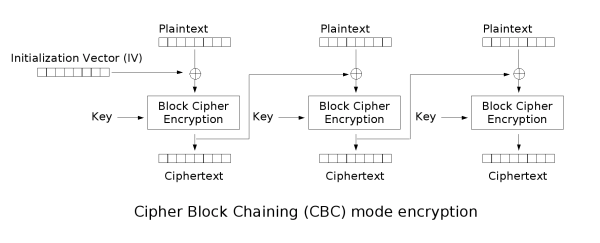
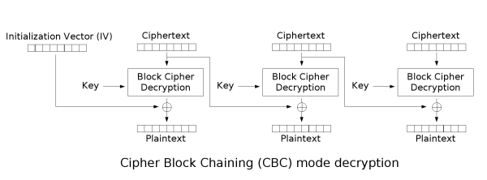

前几天我跟我队友写了一道逆向，说是逆向题其实是个密码学的题目

是这样的：
出题人构造了一个 AES cipher

给出了密钥（key），明文（plainText），密文（cipherText），使用的是 密码分组链接 CBC（Chiper Block Chaining） 模式。要求出 初始化向量 IV（Initalization Vector)

其实要是熟悉 CBC 模式的话很快就能求出来。

下面是 CBC 的加密流程

加密：



1. 先把明文（PlainText）填充（pad）成长度为 16 的倍数
2. 根据设定的块大小（block size）来分组
3. 第一组明文（p1）先与初始化向量 IV 进行异或运算得到一个二进制序列（enc_msg)
4. 然后使用密钥（key） 去加密 enc1_msg，得到密文（CipherText）
5. 把当前的密文当成下一个明文组（p2）的初始化向量重复上面的流程直到加密完成

```c
PlainText = pad(PlainText)
enc_msg = xor(PlainText, IV)
CipherText = encrypt(key, enc_msg)
```


解密：



解密是加密的逆过程

1. 也是把密文（CipherText）按照每组长度为 16 的倍数来分组
2. 然后使用 密钥（key）解密最后一个分组密文（CipherTextN），得到一个序列（fake_msgN)
3. 再把前一个分组（CipherTextN-1）的当成初始化向量 IV，解密 fake_msgN 得到明文 PlainTextN。重复以上流程直到解密完成

```c
fake_msgN = encrypt(key, CipherTextN)
PlainTextN = xor(key, CipherTextN-1)
```


现在看题目

之前我写的题目是道逆向题，.net 写的，为了方便，这个题目是我用 python 复现的

```python
from Crypto.Cipher import AES

key = "09e6855d293a1b86ff44f18948b19bac".decode("hex")
cipherText1 = "ed64978b91ef5b62561a44c8f529b91f".decode("hex")
cipherText = "fd6dd5e0f9ab258b2bc9c813177e3ad677116d2f08c69517d0e7796c1f5e06ba95c3de5a139bb687bf3e779a0730e47c".decode(
    "hex")
plainText = "CBC_Cr4cked_succ"
iv = raw_input("give me iv :> ")
aes = AES.new(key, AES.MODE_CBC, iv)
aes1 = AES.new(key, AES.MODE_CBC, iv)

if aes.decrypt(cipherText1) == plainText:
    flag = input("give me flag :> ")
    if aes1.encrypt(flag) == cipherText:
        print("you get it")
    else:
        print("nonono")
else:
    print("nonono")

```


上面的可以得到的信息

```python
key = "09e6855d293a1b86ff44f18948b19bac".decode("hex")
cipherText1 = "ed64978b91ef5b62561a44c8f529b91f".decode("hex")
cipherText = "fd6dd5e0f9ab258b2bc9c813177e3ad677116d2f08c69517d0e7796c1f5e06ba95c3de5a139bb687bf3e779a0730e47c".decode("hex")
plainText = "CBC_Cr4cked_succ"
iv  = ''
```

现在我们有了明文密文和密钥，直接逆向 CBC

步骤是这样的：

1. 伪造一个 fakeIV = "aaaaaaaaaaaaaaaa"
2. 使用 fakeIV 和 key 去构造 Cipher -- fakeIVAes
3. 使用这个 fakeIVAes 去解密 cipherText1，得到一个假的明文 fakePlainText
4. 然后把 cipherText1 和 fakeIV 作异或运算得到 enc_msg 
5. 把 enc_msg  和 plainText 作异或运算就能得到真正的 IV


这里我要讲一下第 4,5 步 为什么使用伪造的 IV -- fakeIV 异或 <u>**再和**</u> 明文 异或就能得到 真的 IV 了呢

我们现在有了 key 和密文和明文，只要再构造一个 假的 IV -- fakeIV 就能构造起一个 Cipher，enc_msg（使用 key 加密后得到的） 异或 fakeIV 得到错误的明文（fakePlainText），只要把 fakePlainText 和 fakeIV 异或自然能得到 enc_msg。

像是：

```
1 ^ 11110 = 11111
11111 ^ 1 = 11110
```

其实仔细观察的话会发现 IV 和用 key 加密后的密文（enc_msg）和 明文（cipherText1）是异或（xor）关系。这样的话只要把 enc_msg 和 cipherText1 作异或运算就能得到 IV，因为 cipherText1 是使用正确 IV 加密过的。

这个是猜解 IV 的 demo 脚本：

iv 是随机的，运行后会发现 crackIV 和 iv 一样

```python
import os
from Crypto.Cipher import AES

iv = os.urandom(16)
key = os.urandom(16)

def pad(plainText):
        return plainText + (chr(len(plainText)) * (16 - (len(plainText) % 16)))


aes = AES.new(key, AES.MODE_CBC, iv)
plainText = raw_input(">")
print("plainText : " + pad(plainText).encode('hex'))
cipherText = aes.encrypt(pad(plainText))
print("cipherText : " + cipherText.encode("hex"))

iv1 = "a" * 16
aes2 = AES.new(key, AES.MODE_CBC, iv1)
fakePlainText = aes2.decrypt(cipherText)
crackIV = ''

for i in range(16):
        crackIV += chr(ord(fakePlainText[i]) ^ ord(iv1[i]) ^ ord(pad(plainText)[i]))

print("True iv : " + iv.encode("hex"))
print("Crack iv : " + crackIV.encode("hex"))
```


回到上面的题目

题目的解：

```python
from Crypto.Cipher import AES

def xor(p1, p2):
    tmp = ''
    for i in range(len(p2)):
        tmp += chr(ord(p1[i]) ^ ord(p2[i]))
    return tmp

key = "\t\xe6\x85]):\x1b\x86\xffD\xf1\x89H\xb1\x9b\xac"
cipherText1 = "ed64978b91ef5b62561a44c8f529b91f".decode("hex")
cipherText = "fd6dd5e0f9ab258b2bc9c813177e3ad677116d2f08c69517d0e7796c1f5e06ba95c3de5a139bb687bf3e779a0730e47c".decode("hex")
plainText = "CBC_Cr4cked_succ"
fakeIV = "aaaaaaaaaaaaaaaa"

fakeIVAes = AES.new(key, AES.MODE_CBC, fakeIV)

fakePlainText = fakeIVAes.decrypt(cipherText1)
enc_msg = xor(fakePlainText, fakeIV)
iv = xor(enc_msg, plainText)
print len(iv)
print "iv is : " + iv

aes = AES.new(key, AES.MODE_CBC, iv)
flag = aes.decrypt(cipherText)
print flag
```

flag：we_ax{cr4ck_43s_CBC_Cr4cked_succ3ssfu11y!_asdfg}


